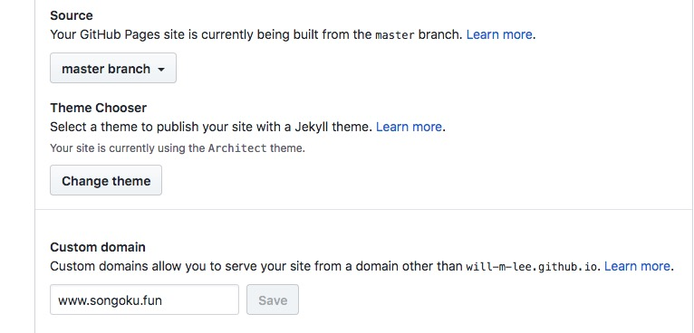

# 程序员的浪漫

## 示例网页
[http://www.songoku.fun/](http://www.songoku.fun/)

## 使用方法

原来 Gitpages 还可以这么使用，如果正在使用 Gitpages 搭建博客的话，可以将同个账号下另一个仓库 Html 网页进行显示,访问地址示例为

`http://userName.github.io/romantic_page`

如果有私有域名可以设置Custom domain,但是设置之后只能通过私有域名访问而不能通过userName.github.io域名访问

## 效果图

点 **Star** 或者 **Fork 的人**，祝你们幸福哦 ~
不点的,也会幸福

(借鉴于某人的romantic_page项目,但未找到原始项目,无法声明链接,望见谅)
